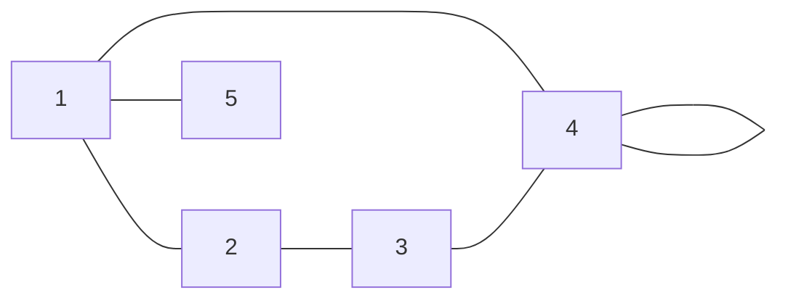
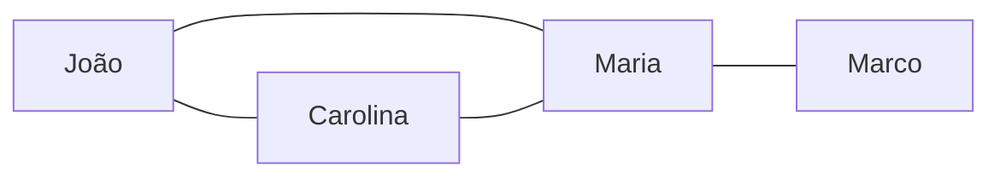
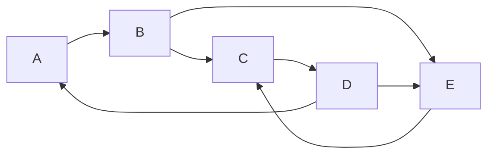
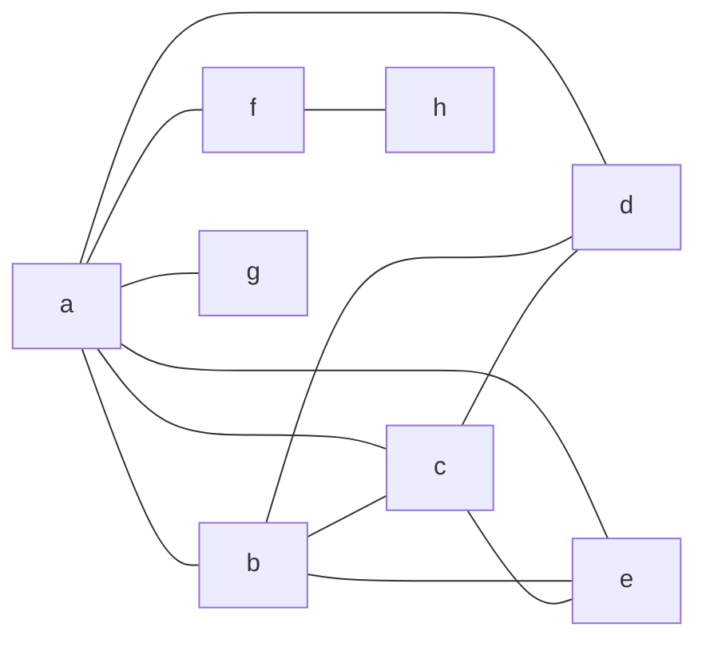

# Atividade - Prática de Grafos

## Identificação
- Nome: Luan Bispo Silva
- RGM: 32635648
- Turma: Estrutura de Dados II
- Data: 03/10
- Ferramenta utilizada: Google Colab com Python/NetworkX

---

## Contexto da atividade

### Disciplina e conteúdo
Unidade III - Grafos (Profa. Kadidja Valéria), baseada no Capítulo 1 - Conceitos Fundamentais.

### Objetivo
Representar problemas com grafos; identificar vértices, arestas, incidência e adjacência; diferenciar grafos dirigidos e não dirigidos; determinar ordem, tamanho e grau; construir e conferir sequências de graus.

### Observações sobre os dados usados
- Atividades 1 e 2: dados fornecidos no material.
- Atividades 3 e 4 e Desafio 17: o material deixa a construção em aberto, então as amizades, o mapa de ruas e o grafo da sequência de graus foram definidos por mim.
- Atividades 5 e 6 (isomorfismo e subgrafos) usam grafos apresentados pela professora em sala e não estão neste documento.

---

## Atividade 1 - Desenhando um grafo

### Proposta
`V = {1, 2, 3, 4, 5}` e `E = {(1,2), (1,4), (1,5), (2,3), (3,4), (4,4)}`

Nomeei as arestas para referência: e1=(1,2), e2=(1,4), e3=(1,5), e4=(2,3), e5=(3,4), e6=(4,4).

### Pergunta 1. Desenhe o grafo.
R:



A aresta `(4,4)` é o laço no vértice 4.

### Pergunta 2. Qual o número de vértices?
R: 5 vértices (1, 2, 3, 4 e 5).

### Pergunta 3. Qual o número de arestas?
R: 6 arestas (e1 a e6).

### Pergunta 4. Qual a ordem |V|?
R: |V| = 5 (ordem = quantidade de vértices).

### Pergunta 5. Qual o tamanho |E|?
R: |E| = 6 (tamanho = quantidade de arestas).

### Pergunta 6. Existe laço?
R: Sim. A aresta `(4,4)` liga o vértice 4 a ele mesmo. Por isso o grafo é um multigrafo (não é simples).

### Pergunta 7. Qual o grau de cada vértice?
R: Grau = número de arestas incidentes, com o laço contando duas vezes.

| Vértice | Arestas incidentes | Grau |
|---|---|---:|
| 1 | e1, e2, e3 | 3 |
| 2 | e1, e4 | 2 |
| 3 | e4, e5 | 2 |
| 4 | e2, e5, e6 (laço conta 2×) | 4 |
| 5 | e3 | 1 |

Verificação: 3+2+2+4+1 = 12 = 2 × |E|.

---

## Atividade 2 - Incidência e adjacência

Usando o grafo da Atividade 1.

### Pergunta 1. Liste os vértices adjacentes a cada vértice.
### Pergunta 2. Informe as arestas incidentes em cada vértice.
R:

| Vértice | Vértices adjacentes | Arestas incidentes |
|---|---|---|
| 1 | 2, 4, 5 | (1,2), (1,4), (1,5) |
| 2 | 1, 3 | (1,2), (2,3) |
| 3 | 2, 4 | (2,3), (3,4) |
| 4 | 1, 3 (e ele mesmo, pelo laço) | (1,4), (3,4), (4,4) |
| 5 | 1 | (1,5) |

### Pergunta 3. Escolha dois vértices adjacentes e explique por que são vizinhos.
R: Os vértices 1 e 2 são adjacentes porque existe a aresta `(1,2)` entre eles. Essa aresta é incidente a ambos. Adjacência é relação entre vértices; incidência é relação entre aresta e vértice.

### Pergunta 4. Escolha dois vértices não adjacentes e justifique.
R: Os vértices 2 e 4 não são adjacentes porque `(2,4)` não pertence a E. Para ir de 2 a 4 é preciso passar por outro vértice (2→1→4 ou 2→3→4).

---

## Atividade 3 - Modelagem de uma rede de amizades

### Pergunta 1. Defina o conjunto de vértices V.
R: `V = {João, Carolina, Maria, Marco}`

### Pergunta 2. Defina o conjunto de arestas E.
R: `E = {(João, Carolina), (João, Maria), (Carolina, Maria), (Maria, Marco)}`

### Pergunta 3. Desenhe o grafo correspondente.
R:



### Pergunta 4. O grafo deve ser dirigido ou não dirigido?
R: Não dirigido.

### Pergunta 5. Justifique a escolha.
R: A amizade é uma relação simétrica: se João é amigo de Carolina, Carolina é amiga de João. A aresta liga um par não ordenado de vértices, então `(João, Carolina)` equivale a `(Carolina, João)`. Não há origem nem destino, logo não se usam setas.

### Pergunta 6. Quem possui maior grau?
R:

| Pessoa | Grau |
|---|---:|
| João | 2 |
| Carolina | 2 |
| **Maria** | **3** |
| Marco | 1 |

Maria tem o maior grau (3): é amiga de João, Carolina e Marco. Soma dos graus = 8 = 2 × 4 arestas.

### Questão para reflexão. O que os vértices e as arestas representam nesse problema?
R: Os vértices representam as pessoas. As arestas representam a relação de amizade entre duas pessoas. O grau de um vértice indica quantos amigos aquela pessoa tem na rede.

---

## Atividade 4 - Modelagem de ruas de mão única

### Pergunta 1. Represente cada cruzamento por um vértice e cada rua por uma aresta dirigida.
### Pergunta 2. Defina os conjuntos V e E.
R:

`V = {A, B, C, D, E}` (cruzamentos)

`E = {(A,B), (B,C), (C,D), (D,A), (B,E), (E,C), (D,E)}` (`(u,v)`: sai de u e chega em v)

### Pergunta 3. Use setas para indicar o sentido permitido.
R:



### Pergunta 4. Escolha um vértice e determine grau de entrada e grau de saída.
R: Para o vértice B: grau de entrada = 1 (chega `(A,B)`) e grau de saída = 2 (partem `(B,C)` e `(B,E)`).

| Vértice | Grau de entrada | Grau de saída |
|---|---:|---:|
| A | 1 | 1 |
| B | 1 | 2 |
| C | 2 | 1 |
| D | 1 | 2 |
| E | 2 | 1 |
| **Soma** | **7** | **7** |

A soma dos graus de entrada e a de saída são iguais a |E| = 7.

### Pergunta 5. Por que um grafo não dirigido não representa adequadamente essa situação?
R: Em um grafo não dirigido a aresta `{A,B}` vale nos dois sentidos, o que permitiria ir de B para A mesmo sendo uma rua de mão única (só A→B). O modelo perderia a informação de sentido, aceitaria rotas proibidas e não permitiria diferenciar grau de entrada e de saída.

---

## Desafio 17 - Grafo simples com sequência de graus (1,1,2,3,3,4,4,6)

### Pergunta. Desenhe um grafo simples com essa sequência de graus.
R:

Viabilidade: 8 vértices e soma dos graus = 24, logo |E| = 12. Pelo algoritmo de Havel-Hakimi a sequência é gráfica, então existe grafo simples.

Construção (vértices nomeados pelo grau desejado: a=6, b=4, c=4, d=3, e=3, f=2, g=1, h=1):

1. `a` liga em b, c, d, e, f, g.
2. `b` liga em c, d, e.
3. `c` liga em d, e.
4. `f` liga em h.

`E = {ab, ac, ad, ae, af, ag, bc, bd, be, cd, ce, fh}` (12 arestas, sem laços nem paralelas)



| Vértice | Vizinhos | Grau |
|---|---|---:|
| a | b, c, d, e, f, g | 6 |
| b | a, c, d, e | 4 |
| c | a, b, d, e | 4 |
| d | a, b, c | 3 |
| e | a, b, c | 3 |
| f | a, h | 2 |
| g | a | 1 |
| h | f | 1 |

Sequência final de graus (ordem não decrescente): `( 1, 1, 2, 3, 3, 4, 4, 6 )`, igual à solicitada.

---

## Validação

Antes de entregar, conferi:
- **Graus, ordem e tamanho (Atividades 1, 3 e 4):** calculei à mão e confirmei no Google Colab com NetworkX (`MultiGraph` para o laço, `Graph` e `DiGraph` para os demais). Os valores bateram.
- **Soma dos graus:** em todos os grafos a soma é igual a 2 × |E| (e, no digrafo, soma de entradas = soma de saídas = |E|).
- **Desafio 17:** o código confirmou a sequência (1,1,2,3,3,4,4,6) e que o grafo é simples (sem laços nem arestas paralelas).

### Código de conferência (Google Colab)

```python
import networkx as nx
import matplotlib.pyplot as plt

# Atividade 1 (multigrafo por causa do laço)
G1 = nx.MultiGraph()
G1.add_nodes_from([1, 2, 3, 4, 5])
G1.add_edges_from([(1, 2), (1, 4), (1, 5), (2, 3), (3, 4), (4, 4)])
print("Ordem:", G1.number_of_nodes(), "| Tamanho:", G1.number_of_edges())
print("Graus:", dict(G1.degree()))  # NetworkX conta o laço 2 vezes

# Atividade 3
G3 = nx.Graph()
G3.add_edges_from([("João", "Carolina"), ("João", "Maria"),
                   ("Carolina", "Maria"), ("Maria", "Marco")])
print("Graus amizade:", dict(G3.degree()))

# Atividade 4 (dirigido)
G4 = nx.DiGraph()
G4.add_edges_from([("A", "B"), ("B", "C"), ("C", "D"), ("D", "A"),
                   ("B", "E"), ("E", "C"), ("D", "E")])
print("Entrada:", dict(G4.in_degree()))
print("Saída:", dict(G4.out_degree()))

# Desafio 17
G17 = nx.Graph()
G17.add_edges_from([("a","b"), ("a","c"), ("a","d"), ("a","e"), ("a","f"),
                    ("a","g"), ("b","c"), ("b","d"), ("b","e"), ("c","d"),
                    ("c","e"), ("f","h")])
seq = sorted(d for _, d in G17.degree())
print("Sequência:", seq, "| Confere:", seq == [1, 1, 2, 3, 3, 4, 4, 6])

# Desenhos
fig, axs = plt.subplots(1, 4, figsize=(20, 4))
nx.draw(G1, ax=axs[0], with_labels=True, node_color="skyblue"); axs[0].set_title("Ativ. 1")
nx.draw(G3, ax=axs[1], with_labels=True, node_color="skyblue"); axs[1].set_title("Ativ. 3")
nx.draw(G4, ax=axs[2], with_labels=True, node_color="skyblue", arrows=True); axs[2].set_title("Ativ. 4")
nx.draw(G17, ax=axs[3], with_labels=True, node_color="skyblue"); axs[3].set_title("Desafio 17")
plt.show()
```

---

## Take Away

### Pergunta 1. Explique, em uma frase, a diferença entre grafo e digrafo.
R: No grafo (não dirigido) a aresta liga um par não ordenado de vértices e vale nos dois sentidos; no digrafo cada aresta é um par ordenado (origem → destino), e `(u,v)` não equivale necessariamente a `(v,u)`.

### Pergunta 2. Dê um exemplo real que possa ser modelado por um grafo.
R: Um mapa de ruas: cruzamentos são vértices e ruas são arestas (dirigidas quando são de mão única). Outro exemplo: seguidores em uma rede social, com pessoas como vértices e "seguir" como aresta dirigida.

### Pergunta 3. Qual conceito de hoje você considera essencial antes de implementar grafos? Por quê?
R: Distinguir grafo dirigido de não dirigido (e saber se há laços ou arestas paralelas). Essa decisão define como armazenar as arestas e como calcular grau e percursos. Se a representação não refletir a direção da relação, o algoritmo pode aceitar caminhos inválidos ou ignorar caminhos válidos.

---

## Referência

GOMES, Paulo César Rodacki. **Grafos: conceitos fundamentais, algoritmos e aplicações**. Blumenau: Editora IFC, 2022.

Material de apoio: Material do Estudante - Prática de Grafos e slides da aula (Unidade III - Grafos, Capítulo 1 - Conceitos Fundamentais), Profa. Kadidja Valéria, UDF Centro Universitário.

### Inteligência artificial utilizada
- Ferramenta: Claude (Anthropic), modelo Claude Sonnet 5.5
- Data de uso: 03/10/2026
