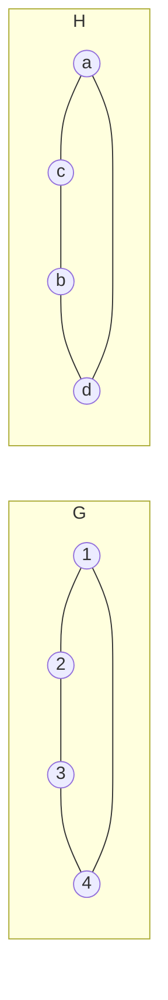
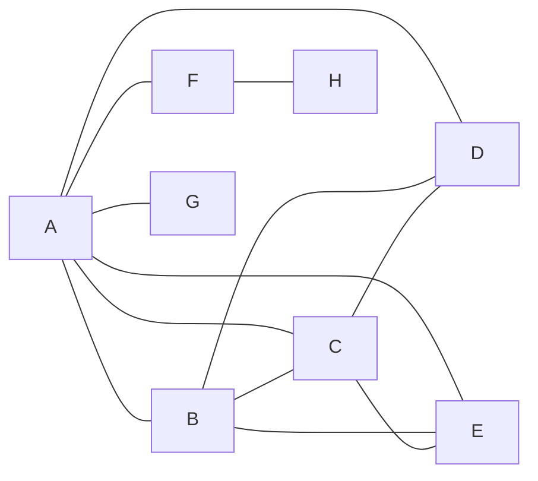

# Atividade - Desafios 5 e 7 (Isomorfismo e Sequência de Graus)

## Identificação
- Nome: Luan Bispo Silva
- RGM: 32635648
- Turma: Estrutura de Dados II
- Data: 09/10
- Ferramenta utilizada: Python/NetworkX (conferência dos resultados)

---

## Contexto da atividade

### Disciplina e conteúdo
Unidade III - Grafos (Profa. Kadidja Valéria), baseada no Capítulo 1 - Conceitos Fundamentais.

### Objetivo
- **Desafio 5:** verificar se dois grafos com rótulos e desenhos diferentes têm a mesma estrutura (isomorfismo).
- **Desafio 7:** construir um grafo simples a partir de uma sequência de graus e conferir a soma dos graus.

### Observação sobre os dados
No Desafio 5 os grafos G e H são fornecidos no material. No Desafio 7 o material só dá a sequência de graus; a escolha das arestas é minha. A mesma sequência apareceu como Desafio 17 na [atividade prática de grafos](atividade-pratica-grafos.md); aqui reconstruí o grafo com os vértices A a H, como pede o material.

---

## Desafio 5 - Isomorfismo

### Proposta
```text
G: V = {1, 2, 3, 4};  E = {(1,2), (2,3), (3,4), (4,1)}
H: V = {a, b, c, d};  E = {(a,c), (c,b), (b,d), (d,a)}
```



### Passo 1. Ordem e tamanho de cada grafo
R: Ordem = quantidade de vértices; tamanho = quantidade de arestas.

| Grafo | Ordem \|V\| | Tamanho \|E\| |
|---|---:|---:|
| G | 4 | 4 |
| H | 4 | 4 |

### Passo 2. Grau de cada vértice e sequência de graus
R: Em G, cada vértice aparece em duas arestas: o 1 em (1,2) e (4,1), o 2 em (1,2) e (2,3), o 3 em (2,3) e (3,4), o 4 em (3,4) e (4,1). Em H acontece o mesmo: a em (a,c) e (d,a), c em (a,c) e (c,b), b em (c,b) e (b,d), d em (b,d) e (d,a).

| G | Grau | H | Grau |
|---|---:|---|---:|
| 1 | 2 | a | 2 |
| 2 | 2 | b | 2 |
| 3 | 2 | c | 2 |
| 4 | 2 | d | 2 |

Sequência de graus de G: `(2, 2, 2, 2)`. Sequência de graus de H: `(2, 2, 2, 2)`. São iguais, o que é condição **necessária** para o isomorfismo, mas ainda não prova nada (ver reflexão).

### Passo 3. Correspondência entre os vértices
R: Percorrendo o ciclo de G (1 → 2 → 3 → 4 → 1) e o ciclo de H (a → c → b → d → a) na mesma ordem, a função `f: V(G) → V(H)` fica:

| Vértice em G | Correspondente em H |
|---|---|
| 1 | a |
| 2 | c |
| 3 | b |
| 4 | d |

Cuidado com a correspondência "óbvia" pela ordem alfabética (1→a, 2→b, 3→c, 4→d): ela falha, porque (1,2) viraria (a,b), e `(a,b)` não pertence a E(H).

### Passo 4. Verificação aresta por aresta

| Aresta de G | Imagem por f | Pertence a E(H)? |
|---|---|---|
| (1,2) | (f(1), f(2)) = (a, c) | Sim |
| (2,3) | (f(2), f(3)) = (c, b) | Sim |
| (3,4) | (f(3), f(4)) = (b, d) | Sim |
| (4,1) | (f(4), f(1)) = (d, a) | Sim |

Também conferi as não-adjacências: (1,3) e (2,4) não são arestas de G e suas imagens (a,b) e (c,d) não são arestas de H. Como f é bijetora e as 4 arestas de G viram as 4 arestas distintas de H, nenhuma aresta de H ficou sem correspondente.

### Passo 5. Conclusão
R: **G e H são isomorfos.** Justificativa: existe uma bijeção f entre V(G) e V(H) tal que `(u,v) ∈ E(G)` se, e somente se, `(f(u), f(v)) ∈ E(H)`. Ambos são o ciclo de 4 vértices (C4); só mudam os rótulos e o desenho.

### Reflexão. Ter a mesma sequência de graus é suficiente para garantir isomorfismo?
R: **Não.** A sequência de graus é uma condição necessária (grafos isomorfos sempre têm a mesma), mas não suficiente. Contraexemplo com 6 vértices: o ciclo C6 e dois triângulos disjuntos (2 × C3) têm a mesma sequência `(2, 2, 2, 2, 2, 2)`, mas C6 é conexo e os dois triângulos não, então não existe bijeção que preserve as adjacências. Analogia: dois prédios com o mesmo número de andares e de apartamentos por andar podem ter plantas completamente diferentes; contar não basta, é preciso conferir as ligações.

---

## Desafio 7 - Sequência de graus

### Proposta
Construir um grafo simples (sem laços e sem arestas paralelas) com 8 vértices e sequência de graus, em ordem não decrescente, `(1, 1, 2, 3, 3, 4, 4, 6)`.

### Viabilidade
Soma dos graus = 1+1+2+3+3+4+4+6 = 24, que é par, então |E| = 24 / 2 = 12 (pelo lema do aperto de mãos). A sequência é gráfica pelo algoritmo de Havel-Hakimi, então existe grafo simples.

### Passo 1. Vértices
R: A, B, C, D, E, F, G e H, com os graus desejados atribuídos em ordem decrescente: A=6, B=4, C=4, D=3, E=3, F=2, G=1, H=1.

### Passo 2. Construção das arestas (do maior grau para o menor)
1. **A (grau 6)** liga em B, C, D, E, F e G. Os graus restantes passam a ser B=3, C=3, D=2, E=2, F=1, G=0, H=1.
2. **B (restam 3)** liga em C, D e E. Restam C=2, D=1, E=1, F=1, H=1.
3. **C (restam 2)** liga em D e E. Restam D=0, E=0, F=1, H=1.
4. **F (resta 1)** liga em H. Todos os graus restantes zeram.

### Passo 3. Conjunto de arestas
R: `E = {AB, AC, AD, AE, AF, AG, BC, BD, BE, CD, CE, FH}` (12 arestas, sem laços e sem paralelas).



### Passo 4. Grau de cada vértice e sequência ordenada

| Vértice | Vizinhos | Grau obtido |
|---|---|---:|
| A | B, C, D, E, F, G | 6 |
| B | A, C, D, E | 4 |
| C | A, B, D, E | 4 |
| D | A, B, C | 3 |
| E | A, B, C | 3 |
| F | A, H | 2 |
| G | A | 1 |
| H | F | 1 |

Sequência obtida: `(1, 1, 2, 3, 3, 4, 4, 6)`, igual à solicitada.

### Passo 5. Verificação da soma dos graus
- Soma dos graus: 6+4+4+3+3+2+1+1 = **24**
- Número de arestas: **12**
- Soma dos graus = 2 × número de arestas? 24 = 2 × 12. **Sim.**

Justificativa matemática: cada aresta contribui com 1 para o grau de cada uma das duas extremidades, então a soma dos graus conta cada aresta duas vezes (Σ grau(v) = 2|E|). Isso também explica por que uma sequência com soma ímpar nunca poderia ser de um grafo.

---

## Validação

Antes de entregar, conferi:
- **Desafio 5:** ordem, tamanho e sequência de graus; a correspondência f preserva todas as adjacências; a tentativa por ordem alfabética falha; `nx.is_isomorphic(G, H)` retornou `True`.
- **Reflexão:** C6 e 2 × C3 têm a mesma sequência de graus, mas `nx.is_isomorphic` retornou `False` (um é conexo e o outro não).
- **Desafio 7:** sequência obtida igual à pedida, soma dos graus = 24 = 2 × 12, sem laços e sem arestas paralelas, e `nx.is_graphical` retornou `True`.

### Código de conferência (Python 3.13 + NetworkX 3.6)

```python
import networkx as nx

# ---------- Desafio 5 ----------
G = nx.Graph([(1, 2), (2, 3), (3, 4), (4, 1)])
H = nx.Graph([("a", "c"), ("c", "b"), ("b", "d"), ("d", "a")])

print("G -> ordem:", G.number_of_nodes(), "| tamanho:", G.number_of_edges())
print("H -> ordem:", H.number_of_nodes(), "| tamanho:", H.number_of_edges())
print("Graus G:", dict(G.degree()), "| sequência:", sorted(d for _, d in G.degree()))
print("Graus H:", dict(H.degree()), "| sequência:", sorted(d for _, d in H.degree()))

# Correspondência escolhida à mão
f = {1: "a", 2: "c", 3: "b", 4: "d"}
ok = all(H.has_edge(f[u], f[v]) for u, v in G.edges())
imagem = {frozenset((f[u], f[v])) for u, v in G.edges()}
cobre = imagem == {frozenset(e) for e in H.edges()}
print("f preserva adjacências:", ok, "| imagem das arestas = E(H):", cobre)

# Tentativa ingênua (mesma ordem alfabética) falha
g = {1: "a", 2: "b", 3: "c", 4: "d"}
print("Tentativa ingênua preserva?", all(H.has_edge(g[u], g[v]) for u, v in G.edges()))

print("NetworkX is_isomorphic(G, H):", nx.is_isomorphic(G, H))

# Reflexão: mesma sequência de graus não basta
C6 = nx.cycle_graph(6)
dois_triangulos = nx.disjoint_union(nx.cycle_graph(3), nx.cycle_graph(3))
print("C6 sequência:", sorted(d for _, d in C6.degree()))
print("2xC3 sequência:", sorted(d for _, d in dois_triangulos.degree()))
print("C6 conexo?", nx.is_connected(C6), "| 2xC3 conexo?", nx.is_connected(dois_triangulos))
print("C6 isomorfo a 2xC3?", nx.is_isomorphic(C6, dois_triangulos))

# ---------- Desafio 7 ----------
E = [("A", "B"), ("A", "C"), ("A", "D"), ("A", "E"), ("A", "F"), ("A", "G"),
     ("B", "C"), ("B", "D"), ("B", "E"), ("C", "D"), ("C", "E"), ("F", "H")]
D = nx.Graph()
D.add_nodes_from("ABCDEFGH")
D.add_edges_from(E)

graus = dict(D.degree())
seq = sorted(graus.values())
print("\nGraus:", graus)
print("Sequência obtida:", seq, "| confere:", seq == [1, 1, 2, 3, 3, 4, 4, 6])
print("Soma dos graus:", sum(graus.values()), "| arestas:", D.number_of_edges(),
      "| soma == 2*|E|:", sum(graus.values()) == 2 * D.number_of_edges())
print("Sem laços:", nx.number_of_selfloops(D) == 0, "| Graph simples:", not D.is_multigraph())
print("Sequência é gráfica:", nx.is_graphical(seq))
```

---

## Referência

GOMES, Paulo César Rodacki. **Grafos: conceitos fundamentais, algoritmos e aplicações**. Blumenau: Editora IFC, 2022. Capítulo 1.

Material de apoio: Material do Estudante - Desafios 5 e 7 (Unidade III - Grafos), Profa. Kadidja Valéria.

### Inteligência artificial utilizada
- Ferramenta: Claude (Anthropic), modelo Claude Sonnet 5.5
- Data de uso: 09/10/2026
